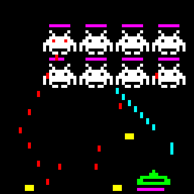

# Canvas

A front-end for my pet project "Canvas", an interactive app where multiple users
over the internet can collaborate or compete on an online grid.

I wanted to explore back-end development as a fun learning activity and built
this simple website to visualize and interact with the grid aka the Canvas.

In its current status is nothing more than a proof of concept, but fully
functional 24/7, it just may not be as fun as I intended.

It started as a clone of
[r/place](https://www.redditinc.com/blog/how-we-built-rplace/) I thought: what
if the activity isn't _draw pixellated pictures_ but the canvas evolves over
time according to some background logic (could be a game, could be anything).
Check out the back-end code at this
[repo](https://github.com/maxcurzi/canvas-backend). Technologies I touched
during develoment of this front-end, which may or may not be present in the
current embodiment.

- HTML
- CSS
- Javascript
- Typescript
- Angular
- React
- HTTP
- HTTPS
- Websockets (WS and WSS)

# Where is it?

The website is deployed/hosted in
[github pages](https://maxcurzi.github.io/canvas) and also accessible via the
domain www.pixels.today The original idea is to have a daily/weekly/monthly game
to keep people check out the site regularly. Let's see how far I get into it. As
of Feb-2023 the two apps I implemented is a simple
[pixel placement](https://www.github.com/maxcurzi/canvas-place) (the grid is
static), and a
[Space Invaders clone](https://www.github.com/maxcurzi/canvas-game-invaders)
with a twist: players can have the aliens shoot, so they can side with either
humans or invaders.

# Future plans

I'd like to (maybe):

- Have an overview of the current state (like, who's winning, or how many
  victories per team)
- Add a chat or live-feed of events ("John Doe destroyed Alien!")
- Add a "Share via Twitter" button, which should add a preview of the current
  canvas to encourage new players to help out
- Add more games and automatically switch between them every X days

nothing else, I want to keep it minimal (kind of like Wordle and r/place).
